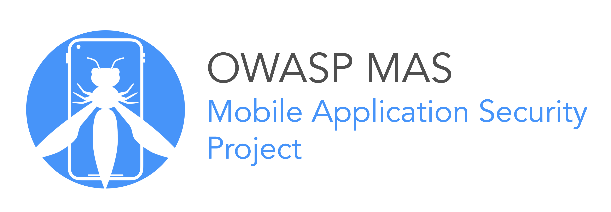
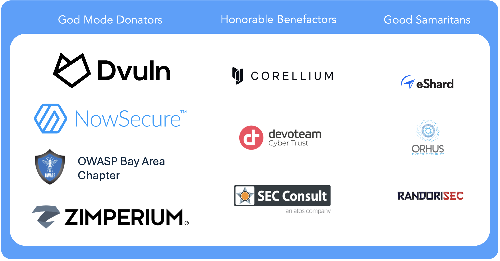

# 本標準について

OWASP Mobile Application Security Verification Standard (MASVS) はモバイルアプリケーションセキュリティの業界標準です。さまざまなプラットフォーム (Android, iOS など) やデプロイメントシナリオ (コンシューマー、エンタープライズなど) において、モバイルアプリのセキュリティを評価するために使用できる包括的なセキュリティコントロールセットを提供します。この標準はストレージ、暗号、認証と認可、ネットワーク通信、モバイルプラットフォームとの連携、コード品質、リバースエンジニアリングと改竄に対する耐性といったモバイルアプリの攻撃対象領域の主要なコンポーネントをカバーしています。

OWASP MASVS は長年にわたるコミュニティの取り組みと業界からのフィードバックの成果です。この標準の形成に貢献したすべての寄稿者に感謝します。私たちは OWASP MASVS に関するフィードバックをいつでも歓迎します。特に組織やモバイルアプリ開発プロジェクトに適用する場合には。さまざまなモバイルアプリ開発者からの意見を得ることで、皆さんの意見やフィードバックを基づいて定期的に改訂される本標準の改善と更新に役立ちます。

OWASP MASVS リポジトリの GitHub Discussions <https://github.com/OWASP/owasp-masvs/discussions> を使ってフィードバックを提供するか、プロジェクトリーダーに直接連絡 <https://mas.owasp.org/contact/> できます。

OWASP MASVS と MASTG は以下のプラットフォームプロバイダ、標準化機関、政府機関、教育機関から信頼を得ています。 [詳細はこちらをご覧ください](https://mas.owasp.org/MASTG/Intro/0x02b-MASVS-MASTG-Adoption/) 。

<!-- \pagebreak -->

## 執筆者

### Sven Schleier

Sven はペネトレーションテストとアプリケーションセキュリティを専門としており、数多くのプロジェクトを指導してその最初からセキュリティを構築してきました。知識の共有を強く信条とし、世界中のミートアップやカンファレンスで講演を行い、非常勤教授として、ペネトレーションテスト担当者、開発者、学生に対してモバイルアプリのセキュリティに関するハンズオンワークショップを開催しています。

### Carlos Holguera

Carlos はモバイルアプリや自動車のコントロールユニットや IoT デバイスなどの組込みシステムのセキュリティテストに長年の実務経験を積んできたモバイルセキュリティリサーチエンジニアです。彼はモバイルアプリのリバースエンジニアリングと動的計装に熱心に取り組んでおり、継続的に学び、知識を共有しています。

### Jeroen Beckers

Jeroen はモバイルセキュリティのリーダーであり、モバイルセキュリティプロジェクトの品質保証とモバイルに関するあらゆることの研究開発を担当しています。Android セキュリティに関する修士論文以来、Jeroen はモバイルデバイスとその (非) セキュリティに関心を持ち続けています。彼は高専、大学、クライアント、カンファレンスでの多くの講演や研修で明らかなように、他の人たちと自分の知識を共有することを大事にしています。

### Bernhard Mueller

Bernhard はあらゆる種類のシステムをハックする才能を持つサイバーセキュリティの専門家です。業界で10年以上にわたり、ソフトウェアに対するゼロデイエクスプロイトを多数公表しています。BlackHat USA は Pwnie Award for Best Research でモバイルセキュリティの先駆的な取り組みを賞賛しました。

### Jeroen Willemsen

Jeroen は主要なセキュリティアーキテクトであり、モバイルセキュリティとリスク管理に対する情熱を持っています。彼はセキュリティコーチ、セキュリティエンジニアとして、そしてフルスタックの開発者として企業をサポートしています。彼は、セキュリティ問題からプログラミングの課題まで、技術的な問題を議論するのが大好きです。

<!-- \pagebreak -->

## 寄稿者

すべての寄稿者は OWASP MAS ウェブサイトの Contributing セクションにリストされています。

<https://mas.owasp.org/contributing/>

## 支援者

MASVS と MASTG のいずれもコミュニティにより無償奉仕で作成および維持されていますが、時には外的支援が必要となることもあります。したがって、テクニカルエディタを雇うことができる資金を提供した支援者に感謝します。彼らの支援は MASVS や MASTG の内容にいかなる形であれ影響を与えないことに注意します。支援パッケージは [OWASP MAS Website](https://mas.owasp.org/donate/packages/) に記載されています。

<!-- \pagebreak -->

## 更新履歴

すべての更新履歴は OWASP MASVS GitHub リポジトリからオンラインで入手できます。 Releases ページを参照してください。

<https://github.com/OWASP/owasp-masvs/releases>

## 著作権とライセンス

Copyright © The OWASP Foundation. 本著作物は [Creative Commons Attribution-ShareAlike 4.0 International License](https://creativecommons.org/licenses/by-sa/4.0/ "Creative Commons Attribution-ShareAlike 4.0 International License") に基づいてライセンスされています。再使用または配布する場合は、他者に対し本著作物のライセンス条項を明らかにする必要があります。

