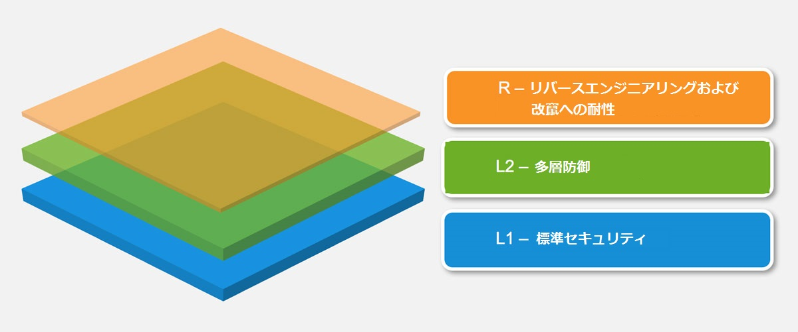

# モバイルアプリケーションセキュリティモデル

MAS プロジェクトでは、企業や開発者がモバイルアプリケーションのセキュリティを評価し、改善するために使用できる、いくつかのセキュリティテストプロファイルを定義しています。ただし、これらのプロファイルを完全にまたは部分的に実装することは、ビジネスオーナーと協議の上で、リスクに基づいて決定する必要があることに留意することが重要です。

\

**MAS-L1 - 標準セキュリティ:**

MAS-L1 には、すべてのモバイルアプリに推奨される一般的なセキュリティコントロールを含みます。このプロファイルは、他のインストール済みアプリとネットワークベースの攻撃者を考慮しますが、モバイルオペレーティングシステムのセキュリティコントロールが無傷であり、エンドユーザーが潜在的な敵対者とみなされていないことを想定しています。これらのコントロールを満たすことで、ベストプラクティスに準拠し、一般的な脆弱性を回避した安全なアプリを実現します。

**MAS-L2 - 多層防御:**

MAS-L2 には、より高度な攻撃から保護するために、さらに多層防御コントロールを備えています。このプロファイルは、モバイルオペレーティングシステムのセキュリティコントロールが無傷ではない可能性があり、アプリユーザーが潜在的な敵対者とみなされる可能性があることを想定しています。モバイルバンキングアプリなど、機密性の高いデータを扱うアプリに適しています。

**MAS-R - 耐性:**

MAS-R には、エンドユーザーが悪意を持っていたり、モバイル OS が侵害されている、特定のクライアントサイドの脅威を阻止するためのソフトウェア保護コントロールを含みます。これらの脅威には、改竄、改造、機密コードやデータを抽出するためのリバースエンジニアリングを含みます。このレベルはゲームアプリや機密情報や独自情報を扱うエンタープライズアプリなど、知的財産を保護する必要があるアプリに適用できます。

**MAS-R コントロールは最終的にバイパスされる可能性があるため、適切なセキュリティコントロールの代替として使用すべきではないことに注意してください。そうではなく、MAS-L1 や MAS-L2 の MASVS コントロールを満たすアプリに、脅威に応じた保護コントロールを追加することを意図しています。**

## 推奨される使い方

MASVS を適用する前に、まずリスク評価を実施する必要があります。アプリは事前のリスク評価と必要とされる全体的なセキュリティレベルに基づいて、さまざまな MAS プロファイルに照らし合わせて検証でき、どの MAS プロファイルをアプリに適用すべきかを決定します。プロファイルの組み合わせは以下が可能であることに注意してください。

- MAS-L1
- MAS-L1 + MAS-R
- MAS-L2
- MAS-L2 + MAS-R

異なる組み合わせは、異なるグレードのセキュリティと耐性を反映しています。脅威モデルは、適用するプロファイルだけでなく、適用可能な (MASTG のテストで表現される) コントロールとリスクを決定するためにも不可欠です。**MAS プロファイルを使用してテストする場合、すべてのテストをそれぞれ個別に適用する必要はありません**

目標は柔軟性を持たせることです。たとえば、モバイルゲームではユーザビリティの理由から 2 要素認証などの MAS-L2 セキュリティコントロールを追加する必要はないかもしれませんが、改竄防止に対する強いビジネスニーズがあるかもしれません。

## セキュリティのトレードオフ

上位の MAS プロファイルからより多くのセキュリティコントロールを追加することで、アプリをより安全にすることができますが、開発コストが増加し、ユーザーエクスペリエンスに悪影響を及ぼす可能性もあります。

### セキュリティとコスト

一般に、MAS プロファイルは、リスクとコストの観点から理にかなっている場合 (つまり、機密性や完全性の危殆化によって生じる潜在的な損失が、追加のセキュリティコントロールによって発生するコストを上回る場合) に使用してください。潜在的な損失とは、機密性や完全性の危殆化がアプリのユーザー、データ、機能性、評判、収益に及ぼす悪影響のことです。セキュリティコントロールのコストとは、セキュリティ機能を実装および維持するために必要な時間、費用、リソースの量です。アプリが攻撃される可能性、アプリのデータが侵害された場合の影響の深刻度、アプリがユーザーやビジネスに提供する価値がどの程度であるかを見積もる必要があります。

たとえば、ユーザーの機密性の高いヘルスデータを扱うモバイルアプリを開発している場合、強力な暗号化と認証機能を確保するために MAS-L2 を使用したいと思うかもしれません。データ侵害による潜在的な損失は、ユーザーのプライバシー、信頼、法的責任の面で非常に大きくなります。これらのセキュリティコントロールの実装コストは、アプリの価値と評判によって正当化されるでしょう。

一方、天気予報やニュース記事などの公開情報を表示するだけのモバイルアプリを開発しているのであれば、MAS-L1 に準拠するだけで通常は十分です。データ侵害による潜在的な損失は、ユーザーのプライバシーと信頼の面で低くなるでしょう。これらのセキュリティコントロールの実装コストは、アプリのわずかな利益に見合うものではありません。

### セキュリティとユーザビリティ

セキュリティ機能の中には、アプリを使いにくくしたり、不便にするものがあり、ユーザー満足度やユーザー維持に影響を及ぼす可能性があります。たとえば、複雑なパスワードや頻繁な認証を要求すると、セキュリティを高めるかもしれませんが、スムーズで迅速なエクスペリエンスを求めるユーザーを苛立たせる可能性もあります。開発者は、アプリの設計プロセスにおいて、セキュリティ要件とユーザビリティ要件の矛盾を予測し、解決する必要があります。

### セキュリティとプライバシー

セキュリティ機能の中には、ユーザーデータへのアクセスや収集が必要となることがあり、プライバシーへの懸念が生じる可能性があります。たとえば、多要素認証として SMS を使用すると、セキュリティを高めるかもしれませんが、機密性の高い個人情報 (ユーザーの電話番号) を公開することにもなります。開発者は、ユーザーのセキュリティとプライバシーのニーズのバランスをとり、関連する法律や規制を遵守する必要があります。

### プライバシーと価値

アプリの中には、ユーザーのデータへのアクセスや共有と引き換えに、ユーザーにより多くの価値や機能を提供するものもあり、プライバシーが侵害される可能性があります。たとえば、アプリの中には、ユーザーの嗜好や位置情報に基づいてパーソナライズされたおすすめや割引を提供する一方で、ユーザーをターゲット広告やサードパーティトラッキングにさらすものもあります。開発者は、ユーザーが自身のプライバシーに関する懸念に基づいて、そのようなアプリをダウンロードして使用することの利点とリスクを比較検討することを認識する必要があります。

## 使用例

### MASVS-L1

- すべてのモバイルアプリ。MASVS-L1 には開発コストとユーザーエクスペリエンスに妥当な影響を与えるセキュリティのベストプラクティスを掲載しています。より高いレベルのものに該当しないアプリには MASVS-L1 のコントロールを適用します。

### MASVS-L2

- ヘルスケア業界：なりすまし犯罪や不正支払などのさまざまな犯罪行為に使用される個人識別情報を保管するモバイルアプリ。米国のヘルスケア分野では、医療保険の相互運用性と説明責任に関する法律 (HIPPA) のプライバシー、セキュリティ、侵害開示に関する規則、患者の安全性に関する規則があります。

- 金融業界：クレジットカード番号、個人情報などの機密性の高い情報にアクセスできたり、ユーザーが送金できるアプリ。これらのアプリは詐欺を防止するための追加のセキュリティコントロールを必要とします。金融アプリはPCIデータセキュリティスタンダード (PCIDSS)、グラム・リーチ・ブライリー法、サーベンス・オクスリー (SOX) 法に準拠する必要があります。

### MASVS L1+R

- 知的財産 (IP) 保護がビジネスゴールであるモバイルアプリ。MASVS-R に掲載されている耐性コントロールは元のソースコードを取得するのに必要な作業を増やし、改竄／クラッキングを防止するために使用できます。

- ゲーム業界：競争の激しいオンラインゲームなど、改造やチート行為を防止することが必要不可欠なゲーム。チート行為はオンラインゲームでの重要な問題です。大量のチート行為者がプレイヤーの不満を招き、最終的にはゲームが失敗となる可能性があります。MASVS-R はチート行為者への負担を増やすために基本的な耐タンパ性コントロールを提供します。

### MASVS L2+R

- 金融業界：ユーザーが送金できるオンラインバンキングアプリ。侵入したデバイスでのコードインジェクションやインストルメンテーションなどの技術によるリスクをもたらします。この場合、MASVS-R のコントロールを使用して改竄を防ぐことで、マルウェア作成者のハードルを上げることができます。

- 設計上、モバイルデバイス上に機密データを保存する必要があると同時に幅広いデバイスやオペレーティングシステムのバージョンをサポートしなければならないすべてのモバイルアプリ。この場合、機密データを抽出することを目指す攻撃者の負担を増やすために多層防御策として耐性コントロールを使用することができます。

- アプリ内購入のあるアプリでは有料コンテンツを保護するためにサーバー側コントロールと MASVS-L2 コントロールを使用するのが理想的です。但し、サーバー側保護を使用できない場合があります。このような場合、リバースや改竄の労力を増やすために MASVS-R コントロールをさらに適用する必要があります。
